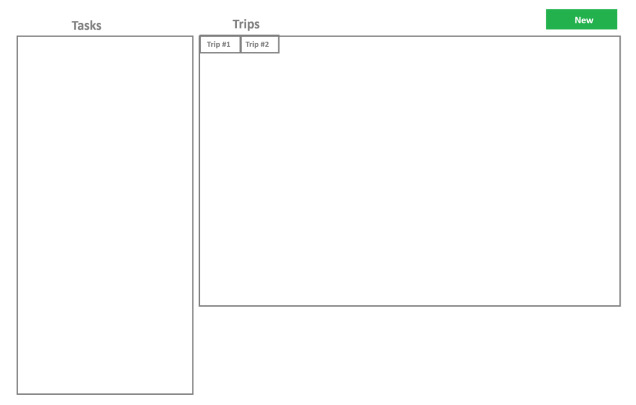

# Task-Trip Manager

### Project Overview
You are required to build a simple web application using the Symfony framework and React (preferred).
The application will manage tasks and trips. The main page will have two sections: tasks on the left and
trips on the right. Users can create trips, assign a driver and truck to each trip, and allocate tasks to
these trips.

### Requirements
1. Main Page Layout\
   • Left Section (Tasks)\
   • Display a list of tasks.\
   • Each task can only be added to one trip.\
   • Right Section (Trips)\
   • Display tabs on top, one for each trip.\
   • Each tab shows the details of a specific trip including its driver, truck, and assigned tasks.\
   • A "New" button allows users to create a new trip.\
   • When creating a trip, users can select a driver and a truck from the existing list.
2. Database Seeding\
   • Seed the database with at least:\
   • 50 tasks\
   • 10 drivers\
   • 10 trucks
3. Functionalities\
   • Users can create new trips.\
   • Users can assign a driver and a truck to each trip during its creation.\
   • Users can add tasks to trips.\
   • Tasks can only be added to one trip.
4. Tech Stack\
   • Backend: Symfony Framework (preferred, but other PHP frameworks are acceptable).\
   • Frontend: React (preferred, but other JS frameworks are acceptable).\
   • Version Control: Add the project to a Git repository and share the link.
### Additional Features
   • Dockerization: Provide a Docker setup for the application.
   
### Suggested Structure
#### Frontend:
   • React components for tasks list, trip details, and trip creation modal.\
   • State management for handling tasks and trips.
#### Backend:
   • Symfony controllers for managing tasks, trips, drivers, and trucks.\
   • Database migrations (Fixtures) and seeders for initial data setup.

### Visual Layout (Mockup)

